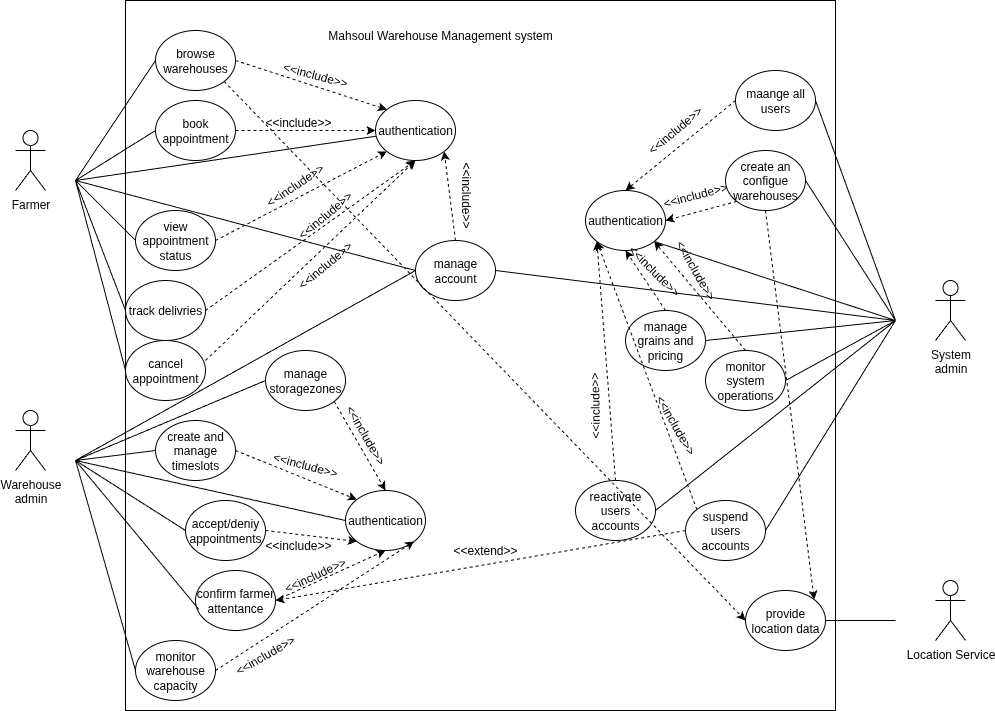
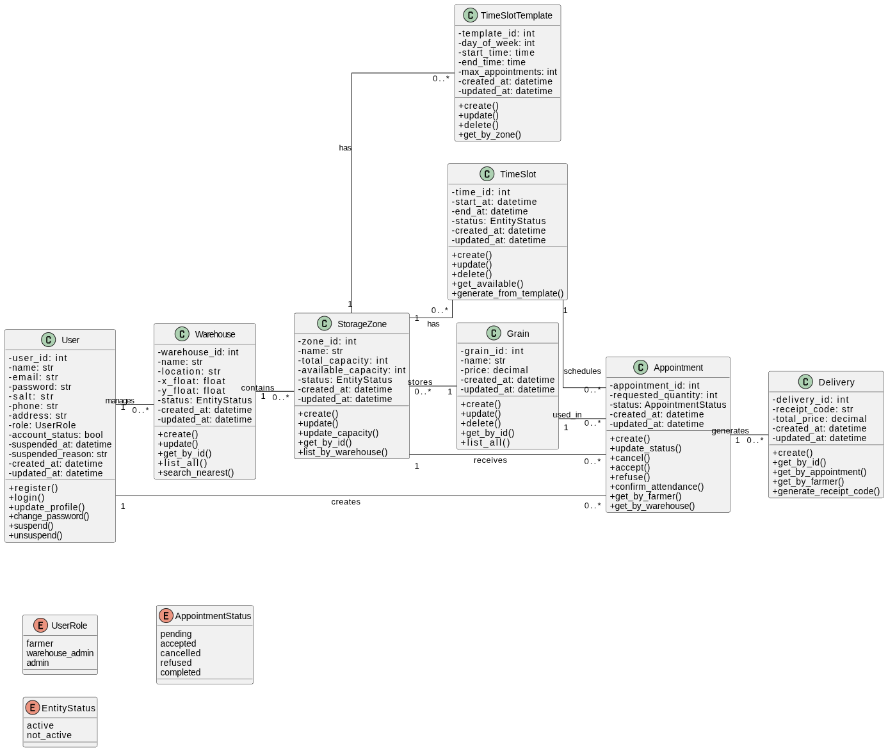
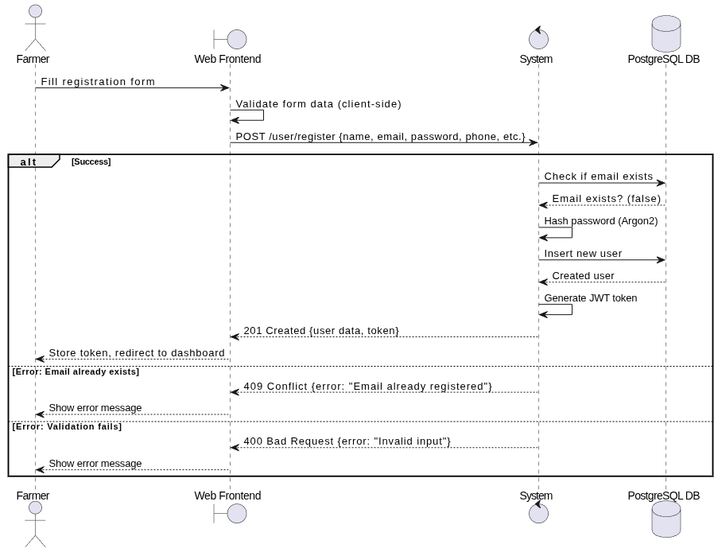
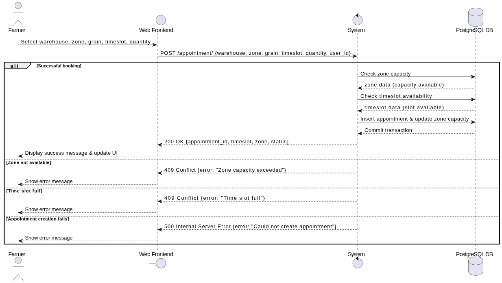
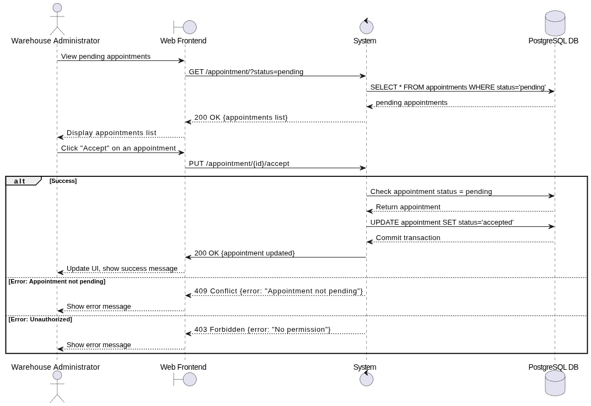
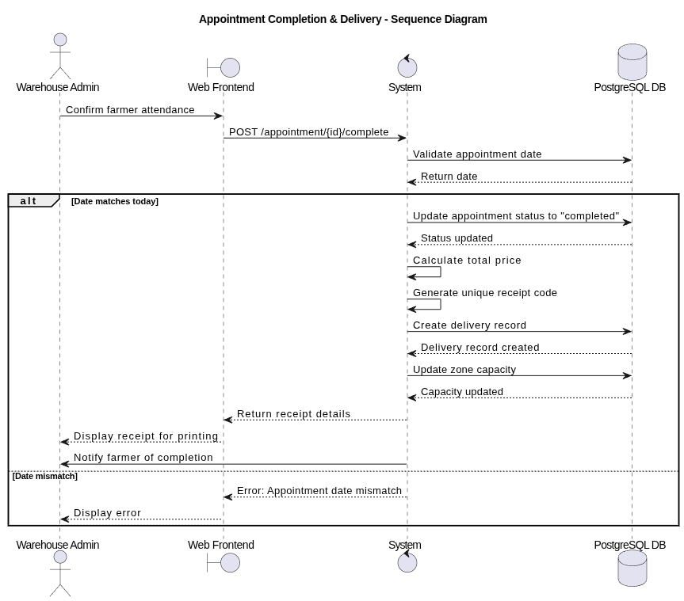
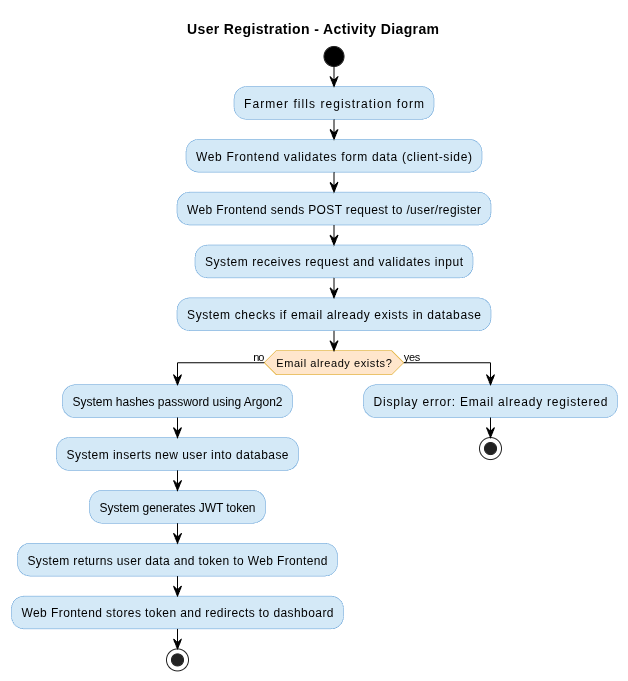
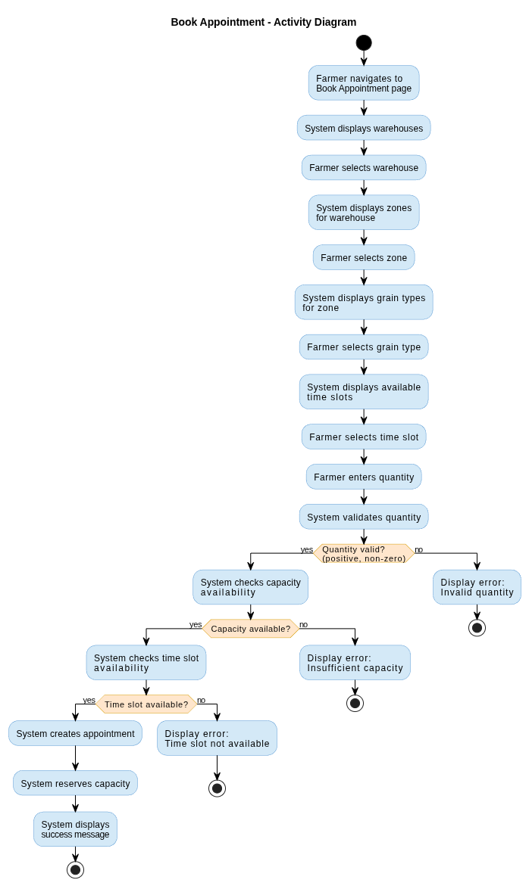
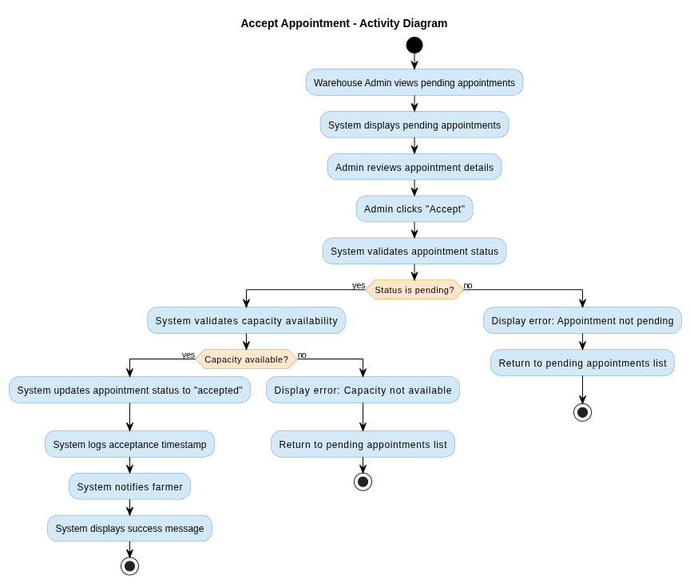
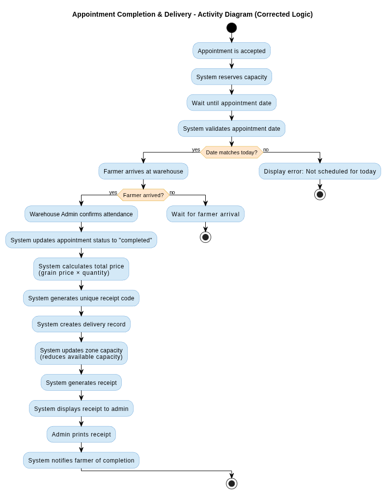

# Sofrware Engineer Project Report

> **Student Name:** : Zouaoui Djasser , Moudjari Abdelrahmane
> **Group** : Group 2

# Table of Content

1. [Introduction](#1-introduction)
2. [Project Description](#2-project-description)
3. [Problem Statement](#3-problem-statement)
4. [Objectives](#4-objectives)
5. [Global System Description](#5-global-system-description)
6. [Actors Identification](#6-actors-identification)
7. [Functional Analysis](#7-functional-analysis)
8. [Use Case Diagram](#8-use-case-diagram)
9. [Use Case Descriptions (Textual)](#9-use-case-descriptions-textual)
10. [Class Diagram](#10-class-diagram)
11. [Sequence Diagrams](#11-sequence-diagrams)
12. [Activity Diagrams](#12-activity-diagrams)
13. [System Architecture](#13-system-architecture)
14. [Technical Choices](#14-technical-choices)
15. [Implementation Overview](#15-implementation-overview)
16. [Conclusion](#16-conclusion)


## 1. Introduction

This project is developed as part of the **Software Engineer** university module. The goal of this project is to apply theoretical concepts of system analysis and modeling using UML (Unified Modeling Language) in a practical software system.

This project demonstrates the application of software engineering principles, UML modeling techniques, and modern software development practices in creating a production-ready enterprise system.

---


## 2. Problem Statement

Traditional grain warehouse management systems suffer from several critical problems:

### 2.1 Current Problems

1. **Manual Processing**
   - Appointment booking requires phone calls or physical visits
   - Time slot management is done manually on paper or spreadsheets
   - No real-time availability information

2. **Poor Data Organization**
   - Warehouse capacity information is not centralized
   - Delivery records are scattered across multiple systems
   - No unified view of operations

3. **Lack of Automation**
   - Time slots must be created manually each week
   - Capacity calculations require manual updates
   - No automated notifications for appointments

4. **Inefficient Communication**
   - Farmers cannot easily find nearby warehouses
   - Warehouse admins cannot efficiently manage appointments
   - No real-time status updates

5. **Limited Accessibility**
   - Farmers must visit warehouses to book appointments
   - No mobile access to system information
   - Limited availability outside business hours

### 2.2 Proposed Solution

**Mahsoul** is a comprehensive grain warehouse management system designed to streamline the process of storing, managing, and delivering grain products. The application enables farmers, warehouse administrators, and system administrators to collaborate efficiently in grain storage and distribution operations through a multi-platform solution consisting of a web application, mobile application, and RESTful API backend.


Mahsoul provides a comprehensive digital solution that:

- **Automates** appointment booking and time slot generation
- **Centralizes** all warehouse and delivery data
- **Enables** real-time capacity tracking and availability
- **Facilitates** geolocation-based warehouse discovery
- **Provides** multi-platform access (web and mobile)
- **Implements** role-based access control for security
- **Generates** automated reports and receipts

---


## 3. Project Description

Mahsoul is a multi-platform grain warehouse management system that digitizes and automates the traditional grain storage workflow. The system consists of three main components:

### 3.1 System Components

1. **Backend API (FastAPI)**
   - RESTful API providing business logic and data management
   - PostgreSQL database for data persistence
   - JWT-based authentication and authorization
   - Background task scheduling for automated operations

2. **Web Frontend (Vue.js)**
   - Responsive web application for desktop and tablet users
   - Role-based dashboards and interfaces
   - Real-time data visualization
   - Interactive warehouse maps

3. **Mobile Application (Flutter)**
   - Cross-platform mobile app for iOS and Android
   - Geolocation-based warehouse discovery
   - Offline-capable features
   - Push notifications support

### 3.2 Core Functionalities

The system manages the complete lifecycle of grain storage operations:

- **User Management**: Registration, authentication, and role-based access control
- **Warehouse Management**: Creation, configuration, and monitoring of storage facilities
- **Storage Zone Management**: Capacity tracking and grain type associations
- **Appointment System**: Time slot generation, booking, and management
- **Delivery Tracking**: Receipt generation and transaction history
- **Geolocation Services**: Location-based warehouse discovery and distance calculations
---

### 3.3 Non-Functional Requirements

**NFR-01: Performance**
- API response time < 200ms for standard queries
- Support for 1000+ concurrent users
- Database queries optimized with indexes

**NFR-02: Security**
- Password hashing
- JWT token expiration (configurable, default 24 hours)
- HTTPS encryption in production
- SQL injection prevention via ORM

**NFR-03: Availability**
- System uptime > 99%
- Graceful error handling
- Database connection pooling

**NFR-04: Scalability**
- Horizontal scaling support
- Stateless API design
- Database read replicas support

**NFR-05: Usability**
- Intuitive user interface
- Mobile-responsive design
- Multi-language support ready
- Accessible design (WCAG compliance)

---


## 5. Global System Description

### 5.1 System Overview

Mahsoul follows a **three-tier architecture** with clear separation of concerns:

```
┌─────────────────────────────────────┐
│      Presentation Layer              │
│  (Web Frontend, Mobile App)         │
└────────────────┬────────────────────┘
                 │ HTTP/REST API
┌────────────────▼────────────────────┐
│      Application Layer               │
│  (FastAPI Backend, Business Logic)  │
└────────────────┬────────────────────┘
                 │ SQL Queries
┌────────────────▼────────────────────┐
│      Data Layer                      │
│  (PostgreSQL Database)               │
└─────────────────────────────────────┘
```

### 5.2 System Layers

#### 5.2.1 Presentation Layer
- **Web Frontend (Vue.js)**: Browser-based interface for desktop users
- **Mobile App (Flutter)**: Native mobile applications for iOS and Android
- **Responsibilities**:
  - User interface rendering
  - User input validation
  - API communication
  - State management
  - Authentication token handling

#### 5.2.2 Application Layer
- **Backend API (FastAPI)**: RESTful API server
- **Components**:
  - **Routes**: HTTP endpoint handlers
  - **Services**: Business logic implementation
  - **Repositories**: Database access layer
  - **Models**: Data validation and ORM models
- **Responsibilities**:
  - Request processing and validation
  - Business rule enforcement
  - Authentication and authorization
  - Data transformation
  - Background task scheduling

#### 5.2.3 Data Layer
- **PostgreSQL Database**: Relational database management system
- **Responsibilities**:
  - Data persistence
  - Transaction management
  - Data integrity enforcement
  - Query optimization

### 5.3 System Boundaries

**In Scope:**
- User authentication and authorization
- Warehouse and storage zone management
- Appointment booking and management
- Time slot generation and scheduling
- Delivery tracking and receipt generation
- Geolocation-based warehouse search
- Grain type and pricing management

**Out of Scope:**
- Payment processing (external system integration)
- Inventory management beyond capacity tracking
- Financial accounting systems
- Third-party logistics integration

---


## 8. Use Case Diagram

### 8.1 Use Case Diagram Description

The use case diagram represents all interactions between the three primary actors (Farmer, Warehouse Administrator, System Administrator) and the Mahsoul system. The diagram shows:


- **Authentication use cases**: Login, Register, Manage Profile
- **Warehouse use cases**: Browse Warehouses, Search Warehouses, Manage Warehouses
- **Appointment use cases**: Book Appointment, View Appointments, Accept/Refuse Appointment, Cancel Appointment
- **Time Slot use cases**: Generate Time Slots, Create Time Slot Template, View Available Slots
- **Zone use cases**: Create Zone, Update Capacity, View Zones
- **Delivery use cases**: View Deliveries, Confirm Attendance, Generate Receipt
- **Grain use cases**: Manage Grain Types, Update Prices
- **User Management use cases**: Suspend User, Reactivate User, View Users



## 9. Use Case Descriptions (Textual)

### 9.1 Use Case: User Registration


**Use Case Name:** Register Account  
**Actor:** Farmer, Warehouse Administrator  
**Precondition:** User is not registered in the system  
**Postcondition:** User account is created and user is authenticated  

**Main Flow:**
1. User navigates to registration page
2. User selects role (Farmer or Warehouse Administrator)
3. User enters name, email, password, phone, and address
4. System validates email format and uniqueness
5. System validates password strength (minimum 8 characters)
6. System hashes password using Argon2
7. System creates user account with selected role
8. System generates JWT token
9. System returns user data and token
10. User is redirected to appropriate dashboard based on role

**Alternative Flows:**
- **3a.** Invalid email format → System displays error message, return to step 3
- **4a.** Email already exists → System displays error "Email already registered", return to step 3
- **5a.** Weak password → System displays password requirements, return to step 3
- **7a.** Database error → System displays error message, registration fails

**Business Rules:**
- Email must be unique across all users
- Password must be at least 8 characters
- Phone number format is validated
- System Administrator accounts can only be created by existing admins

---


### 9.3 Use Case: Book Appointment

**Use Case ID:** UC-003  
**Use Case Name:** Book Appointment  
**Actor:** Farmer  
**Precondition:** User is authenticated as Farmer, warehouse zones exist with available time slots  
**Postcondition:** Appointment is created with "pending" status, capacity is reserved  

**Main Flow:**
1. Farmer navigates to "Book Appointment" page
2. System displays list of available warehouses
3. Farmer selects a warehouse
4. System displays storage zones for selected warehouse
5. Farmer selects a storage zone
6. System displays available grain types for selected zone
7. Farmer selects grain type
8. System displays available time slots for selected zone
9. Farmer selects a time slot
10. Farmer enters requested quantity
11. System validates quantity is positive and within available capacity
12. System checks time slot availability
13. System creates appointment with status "pending"
14. System reserves capacity (reduces zone available capacity)
15. System displays success message with appointment details
16. Farmer is redirected to "My Appointments" page

**Alternative Flows:**
- **3a.** No warehouses available → System displays message, use case ends
- **5a.** No zones available for warehouse → System displays message, return to step 3
- **7a.** No grain types available → System displays message, return to step 5
- **9a.** No available time slots → System displays message, return to step 5
- **11a.** Quantity exceeds available capacity → System displays available capacity, return to step 10
- **11b.** Invalid quantity (negative or zero) → System displays error, return to step 10
- **12a.** Time slot fully booked → System displays error, return to step 8

**Business Rules:**
- Capacity is reserved immediately upon appointment creation
- If appointment is refused, capacity is released
- Farmers can only book appointments for future time slots
- Maximum quantity cannot exceed zone available capacity

---


### 9.4 Use Case: Accept Appointment

**Use Case ID:** UC-004  
**Use Case Name:** Accept Appointment  
**Actor:** Warehouse Administrator  
**Precondition:** User is authenticated as Warehouse Administrator, pending appointment exists for their warehouse  
**Postcondition:** Appointment status changes to "accepted", farmer is notified  

**Main Flow:**
1. Warehouse Administrator navigates to "Pending Appointments" page
2. System displays list of pending appointments for administrator's warehouses
3. Administrator reviews appointment details (farmer, grain type, quantity, time slot)
4. Administrator clicks "Accept" button
5. System validates appointment is still pending
6. System validates capacity is still available
7. System updates appointment status to "accepted"
8. System logs acceptance timestamp
9. System notifies farmer (notification system)
10. System displays success message
11. Appointment appears in "Accepted Appointments" list

**Alternative Flows:**
- **3a.** No pending appointments → System displays "No pending appointments"
- **5a.** Appointment already processed → System displays error, return to step 2
- **6a.** Capacity no longer available → System displays error, appointment cannot be accepted

**Business Rules:**
- Only warehouse administrators assigned to the warehouse can accept appointments
- Capacity must be verified before acceptance
- Accepted appointments cannot be refused (must be cancelled by farmer first)

---


## 10. Class Diagram

### 10.1 Class Diagram Description

The class diagram represents the static structure of the Mahsoul system, showing all classes, their attributes, methods, and relationships. The diagram follows the domain model and includes:





## 11. Sequence Diagrams

### 11.1 Sequence Diagram: User Registration



### 11.2 Sequence Diagram: Book Appointment




### 11.3 Sequence Diagram: Accept Appointment



### 11.4 Sequence Diagrame : Deliviery





## 12. Activity Diagrams


### 12.1 Sequence Diagram: User Registration



### 12.1 Activity Diagram: Appointment Booking Process




### 12.2 Activity Diagram: Appointment Acceptance Workflow




### 12.3 Activity Diagram: Delivery Confirmation Process




## 13. System Architecture

### 13.1 Architectural Pattern

Mahsoul follows a **Layered Architecture (N-Tier Architecture)** pattern with clear separation of concerns:

```
┌─────────────────────────────────────────────────────────┐
│                   Presentation Layer                     │
│  ┌──────────────┐              ┌──────────────┐        │
│  │  Web Client  │              │ Mobile Client │        │
│  │   (Vue.js)   │              │   (Flutter)   │        │
│  └──────┬───────┘              └──────┬───────┘        │
└─────────┼──────────────────────────────┼────────────────┘
          │                              │
          │        HTTP/REST API         │
          │                              │
┌─────────▼──────────────────────────────▼────────────────┐
│                 Application Layer                        │
│  ┌──────────────────────────────────────────────┐      │
│  │            FastAPI Backend Server             │      │
│  │  ┌──────────┐  ┌──────────┐  ┌──────────┐   │      │
│  │  │ Routes   │→ │ Services │→ │Repositories│   │      │
│  │  └──────────┘  └──────────┘  └──────────┘   │      │
│  │  ┌──────────────────────────────────────┐   │      │
│  │  │    Background Scheduler (APScheduler) │   │      │
│  │  └──────────────────────────────────────┘   │      │
│  └──────────────────────────────────────────────┘      │
└─────────┬──────────────────────────────────────────────┘
          │
          │        SQL Queries
          │
┌─────────▼──────────────────────────────────────────────┐
│                    Data Layer                          │
│  ┌──────────────────────────────────────────────┐    │
│  │         PostgreSQL Database                   │    │
│  │  ┌──────────┐  ┌──────────┐  ┌──────────┐    │    │
│  │  │  Users   │  │Warehouses│  │Appointments│   │    │
│  │  └──────────┘  └──────────┘  └──────────┘    │    │
│  └──────────────────────────────────────────────┘    │
└────────────────────────────────────────────────────────┘
```

### 13.2 Component Architecture

#### 13.2.1 Presentation Layer Components

**Web Frontend (Vue.js):**
- **Router**: Vue Router for navigation
- **State Management**: Pinia stores for global state
- **API Client**: Axios for HTTP requests
- **UI Components**: Reusable Vue components
- **Views**: Page-level components

**Mobile App (Flutter):**
- **Navigation**: Go Router for screen navigation
- **State Management**: Riverpod for state
- **API Client**: Dio for HTTP requests
- **Screens**: Page-level widgets
- **Services**: Business logic services


### 13.3 Deployment Architecture

**Production Deployment:**
```
                    ┌─────────────┐
                    │   Nginx     │
                    │ Reverse Proxy│
                    │   Port 80   │
                    └──────┬──────┘
                           │
        ┌──────────────────┼──────────────────┐
        │                  │                  │
┌───────▼──────┐  ┌────────▼────────┐  ┌─────▼──────┐
│   Frontend   │  │    Backend API   │  │  Database  │
│   (Vue.js)   │  │    (FastAPI)    │  │ (PostgreSQL)│
│   Port 4000  │  │    Port 8000    │  │  Port 5432 │
└──────────────┘  └─────────────────┘  └────────────┘
```

**Docker Compose Services:**
- `backend`: FastAPI application container
- `frontend`: Nginx serving Vue.js build
- `db`: PostgreSQL database container
- `reverse_proxy`: Nginx reverse proxy

### 13.4 Communication Patterns

**Synchronous Communication:**
- HTTP/REST API calls between clients and backend
- Database queries using asyncpg

**Asynchronous Communication:**
- Background task scheduling (APScheduler)
- Future: Message queue for notifications (Redis/RabbitMQ)

**Data Flow:**
1. Client sends HTTP request → API Route
2. Route validates and delegates → Service
3. Service executes business logic → Repository
4. Repository queries → Database
5. Response flows back through layers

---

## 14. Technical Choices

### 14.1 Backend Technology Stack

| Component | Technology | Version | Justification |
|-----------|-----------|---------|---------------|
| **Framework** | FastAPI | 0.121.3 | Modern, fast, async support, automatic API documentation |
| **Language** | Python | 3.8+ | Easy to learn, extensive libraries, good for rapid development |
| **Database** | PostgreSQL | 16 | Robust, ACID compliant, excellent for relational data |
| **ORM** | SQLModel | 0.0.27 | Combines SQLAlchemy and Pydantic, type-safe |
| **Authentication** | JWT (python-jose) | 3.5.0 | Stateless, scalable, industry standard |
| **Password Hashing** | Argon2 | 25.1.0 | Modern, secure, resistant to attacks |
| **Scheduler** | APScheduler | 3.10.4 | Flexible, supports async, easy to configure |
| **HTTP Server** | Hypercorn | 0.18.0 | ASGI server, supports HTTP/2, production-ready |
| **Validation** | Pydantic | 2.12.4 | Type validation, automatic documentation |

### 14.2 Frontend Technology Stack

| Component | Technology | Version | Justification |
|-----------|-----------|---------|---------------|
| **Framework** | Vue.js | 3.4.21 | Progressive, component-based, easy to learn |
| **Build Tool** | Vite | 5.1.4 | Fast development server, optimized builds |
| **Router** | Vue Router | 4.3.0 | Official router, supports nested routes |
| **State Management** | Pinia | 2.1.7 | Official state management, TypeScript support |
| **HTTP Client** | Axios | 1.6.7 | Promise-based, interceptors, widely used |
| **Styling** | Tailwind CSS | 3.4.1 | Utility-first, rapid UI development |
| **Icons** | Heroicons | 2.1.1 | Beautiful, consistent icon set |
| **Maps** | Leaflet | 1.9.4 | Open-source, supports OpenStreetMap |

### 14.3 Mobile Technology Stack

| Component | Technology | Version | Justification |
|-----------|-----------|---------|---------------|
| **Framework** | Flutter | 3.0+ | Cross-platform, single codebase, excellent performance |
| **Language** | Dart | 3.2.0+ | Modern, type-safe, good tooling |
| **State Management** | Riverpod | 2.4.9 | Type-safe, testable, modern alternative to Provider |
| **Navigation** | Go Router | 13.0.0 | Declarative routing, deep linking support |
| **HTTP Client** | Dio | 5.4.0 | Powerful HTTP client, interceptors, error handling |
| **Local Storage** | Hive | 2.2.3 | Fast, lightweight NoSQL database |
| **Secure Storage** | flutter_secure_storage | 9.0.0 | Encrypted storage for sensitive data |
| **Maps** | flutter_map | 7.0.2 | OpenStreetMap integration, free, no API key needed |
| **Location** | Geolocator | 10.1.0 | GPS location services |
| **Notifications** | Firebase Cloud Messaging | 14.7.9 | Push notifications support |

### 14.4 Infrastructure & DevOps

| Component | Technology | Justification |
|-----------|-----------|---------------|
| **Containerization** | Docker | Consistent environments, easy deployment |
| **Orchestration** | Docker Compose | Multi-container management, development simplicity |
| **Reverse Proxy** | Nginx | High performance, load balancing, SSL termination |
| **Version Control** | Git | Industry standard, collaboration support |
| **Database Driver** | asyncpg | Fast async PostgreSQL driver |
| **Logging** | Python logging | Built-in, configurable, file rotation |

### 14.5 Development Tools

| Tool | Purpose |
|------|---------|
| **VS Code / Cursor** | Code editor |
| **Postman / Insomnia** | API testing |
| **pgAdmin** | Database management |
| **Draw.io** | UML diagram creation |
| **PlantUML** | Code-based diagram generation |

### 14.6 Design Patterns Used

1. **Repository Pattern**: Data access abstraction
2. **Service Layer Pattern**: Business logic separation
3. **Dependency Injection**: Loose coupling
4. **Factory Pattern**: Object creation (database connections)
5. **Singleton Pattern**: Database connection pool
6. **Strategy Pattern**: Authentication strategies
7. **Observer Pattern**: State management (Pinia/Riverpod)

---

### 16.4 Challenges Overcome

1. **Complex Business Logic**: Successfully modeled appointment booking with capacity constraints
2. **Multi-Platform Development**: Maintained consistency across web and mobile
3. **Real-Time Updates**: Implemented capacity tracking with transaction safety
4. **Background Processing**: Automated time slot generation with scheduling
5. **Geolocation**: Integrated location services for warehouse discovery

### 16.5 Future Enhancements

**Potential Improvements:**
- Payment processing integration
- Advanced analytics and reporting
- Mobile push notifications
- Multi-language support
- Inventory management beyond capacity
- Integration with external logistics systems
- Advanced search and filtering
- Export functionality for reports
- Mobile app offline mode
- Real-time chat support

## 16. Conclusion

### 16.1 Project Summary

This project successfully demonstrates the application of UML modeling techniques and software engineering principles in designing and implementing a comprehensive grain warehouse management system. Mahsoul provides a complete solution for automating grain storage operations, from appointment booking to delivery tracking.